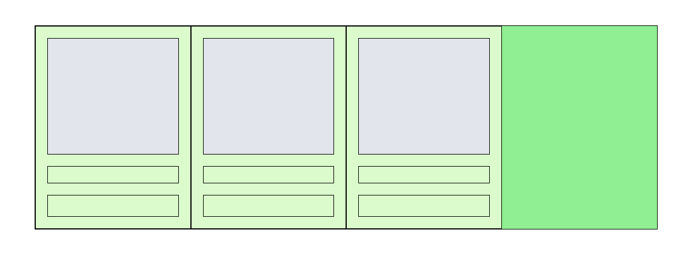

# CSS styleguide

## Units

// TODO relative and static units

### Good practices

### Bad practices

- Including relative units when working with static units
- Including static units when working with relative units

## Naming

// TODO: .wrapper > .container .content > div .....etc.

## Nesting

// TODO .parent > .child > div

## Grid

We use grids to create the entire layout of our page. Every page can be separated to a grid of nested rectangles. No matter how curvy the design is - it can always be described using rectangular shapes (if you do not agree please see [Multivariable Calculus](http://tutorial.math.lamar.edu/Classes/CalcIII/DoubleIntegrals.aspx))

If you're having troubles with the grids in css you should check if your HTML structure is correct first. **CSS code should not have to get around a bad HTML design/nesting.** Rather think about weather your HTML has a good structure before starting with the css grid.

Lets split a single level of a grids into a `container` (parent) element and `cell` child elements. A container element contains cells. A cell could be a container itself but for a deeper level of nesting.

### Good practices

Several rules about grids:
- A container's width is determined by its parent.
- A cell's width should ideally be relative to the parent. (You would rarely need fixed cell widths within a container)
- A cell should not have a margin defined. Cells in a grid should be either right next to each other or separated by using `justify-content`
- A cell should have a `box-sizing:border-box` if it has a `padding`
- A cell should not have a `border` for the same reason as it shouldn't have a `margin`. If you need a border - define it on an element within the cell instead.
- Get familiar with `display: flex` `justify-content:...` `align-items:` `flex-direction:` `flex-wrap:`

### Bad practices

- Using margin between cells in a grid
- Having a `border` on cells

### Example

#### Simple grid example:

So how is this grid constructed?

You can find the code [here](examples/grid_1)

#### Wrapped grid example:

// TODO

## Forms

## Images

// `background-image` vs ``

## The `position:` drama 

// Working with position fixed/absolute/relative. When not to.

## Centering elements

// how to put something in the center of an element. Insights into margin: auto, position: absolute, negative margins. how to make modals and so on...

## Custom shapes

// arrows made with borders, elipses, strange squares, donuts etc.

## CSS in React

// Good practices with reference to HackSoft react styleguide

## General good practices

## General bad practices

- Using `important` when overwriting a non-static class.