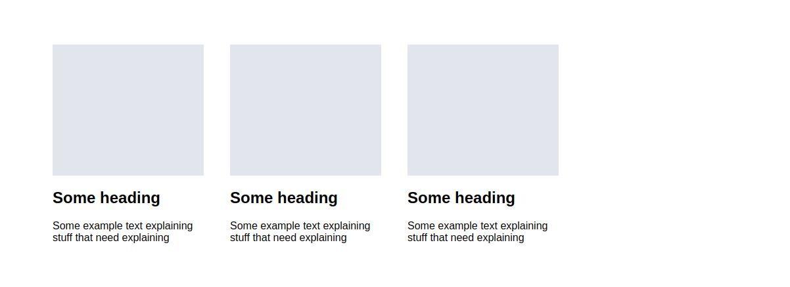

# CSS styleguide

## Units

// TODO relative and static units

### Good practices

### Bad practices

- Including relative units when working with static units
- Including static units when working with relative units

## Naming

// TODO: .wrapper > .container .content > div .....etc.

## Nesting

// TODO .parent > .child > div

## Grid

We use grids to create the entire layout of our page. Every page can be separated to a grid of nested rectangles. No matter how curvy the design is - it can always be described using rectangular shapes (if you do not agree please see [Multivariable Calculus](http://tutorial.math.lamar.edu/Classes/CalcIII/DoubleIntegrals.aspx))

If you're having troubles with the grids in css you should check if your HTML structure is correct first. **CSS code should not have to get around a bad HTML design/nesting.** Rather think about weather your HTML has a good structure before starting with the css grid.

Lets split a single level of a grids into a `container` (parent) element and `cell` child elements. A container element contains cells. A cell could be a container itself but for a deeper level of nesting.

### Good practices

Several rules about grids:
- A container's width is determined by its parent.
- A cell's width should ideally be relative to the parent. (You would rarely need fixed cell widths within a container)
- A cell should not have a margin defined. Cells in a grid should be either right next to each other or separated by using `justify-content`
- A cell should have a `box-sizing:border-box` if it has a `padding`
- A cell should not have a `border` for the same reason as it shouldn't have a `margin`. If you need a border - define it on an element within the cell instead. A cell should only wrap its contents without styling them
- Get familiar with `display: flex` `justify-content:...` `align-items:` `flex-direction:` `flex-wrap:`

### Bad practices

- Using margin between cells in a grid
- Having a `border` on cells

### Examples

**Note:** Troughout all the examples we will not change the way that the html is structured in order to show that we can do any grid by using only css

#### Simple grid example:

So how is this grid constructed?

We can see in the highlighted image that cells have no space between them despite that the gray boxes in the first image have some white space between them. This is because a cell should only wrap its contents and not style them. Note that this space between the gray boxes is made using `padding` in the cells rather than `margin` between the cells.
You can find the code [here](examples/grid)

#### Wrapped grid example:

In order to create a wrapped grid you should have several things in mind:
- The cells should have a flex-basis value that is not merely a number but a percentage or a fixed amount.
- You should be using `justify-content:flex-start` (the default one) instead of `center`
- You should tell your container that elements inside are supposed to be wrapped by stating `flex-wrap: wrap`

##### Common mistake 1:

Using `flex-basis:1;` (relative fraction) instead of `flex-basis: 25%;` (relative percent)

Using `flex-grow: 1;` instead of `flex-grow:0;`. (here we correctly use `flex-basis:25%`)

This doesn't look bad and sometimes it is really the desired behavior. It can easily become a feature rather than a bug. But use it carefully because adding a 7th element results in the following:

And removing an element results in the following:

These last two are mistakes because the grid should rarely (almost never) look differently depending on the amount of elements it has. If you **DO** need a grid that has cells with different widths - check out the *Uneven Grid* section of this styleguide.

**Summary:** `flex-basis` sets the element's minimum width within a grid. `flex-grow` sets if and how much should the element grow if there is space left in the grid. When `flex-grow` is set to 0 it means that the element should not take more space than specified by `flex-basis`. Both `flex-basis` and `flex-grid` are compacted into the `flex` attribute as fhe first and second argument respectively.

##### Common mistake 2:

Not using `flex-wrap` in a multy-line grid:

This happens when using `flex-wrap:nowrap` (the default) despite setting `flex-basis` to 25% or even some fixed ammount (for example 300px). The grid's width is less than the width of all cells combined so they are reduced to an amount that will fit in the container.

##### Common mistake 3:

Using `justify-content: center`
This is sometimes the desired behavior:

You can find the code and play around with it [here](examples/grid/grid_2.html)

#### Uneven grid

This effect is achieved by setting a `large` class on the larger cell with styles `flex-basis:50%;`
You can also do something like this:

You can even do a grid like the following:

Yes this is a grid and note that we haven't changed the html at all. All the cells are in the same container like before. You can see the code [here](examples/grid/grid_4.html)

You can even do something like this:

Code can be found [here](examples/grid/grid_5.html)

#### Grid with spread cells

### Aligning grids on top of each other minding the padding

## Forms

## Images

// `background-image` vs ``

## The `position:` drama 

// Working with position fixed/absolute/relative. When not to.

## Centering elements

// how to put something in the center of an element. Insights into margin: auto, position: absolute, negative margins. how to make modals and so on...

## Symbols in css > + ~ etc.

## Custom shapes

// arrows made with borders, elipses, strange squares, donuts etc.

## CSS in React

// Good practices with reference to HackSoft react styleguide

## General good practices

## General bad practices

- Using `important` when overwriting a non-static class.